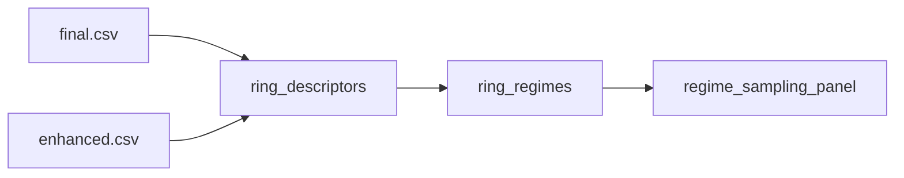

# 01 Coding Guide: Ring-Regime Discovery

## Plan reference
`methods/plans/steps/01_ring_regime_discovery.md`

## Target artifacts
- `data/{tunnel_id}/workflow/{run_id}/01_ring_regime_discovery/ring_descriptors.csv`
- `data/{tunnel_id}/workflow/{run_id}/01_ring_regime_discovery/ring_regimes.csv`
- `data/{tunnel_id}/workflow/{run_id}/01_ring_regime_discovery/regime_sampling_panel.json`

## Files to create or modify
- `methods/ablation/scripts/build_ring_regimes.py` (new)
- optionally `agents/irregular/1_preprocessing/scripts/extract_intrinsics.py` (reuse helpers only)

## Public functions
```python
def extract_ring_descriptors(tunnel_dir: str) -> pd.DataFrame
def assign_regimes(descriptors: pd.DataFrame) -> pd.DataFrame
def build_sampling_panel(regimes: pd.DataFrame, per_regime: int) -> dict
```

## Data flow


## Reuse points
- Ring grouping logic from `agents/irregular/2_detection/2_detection.py`
- Existing intrinsic extraction patterns in `agents/irregular/3_segmentation/scripts/extract_intrinsics.py`

## Run commands
```bash
./venv/bin/python methods/ablation/scripts/build_ring_regimes.py --tunnel 4-1 --run pilot_001
./venv/bin/python methods/ablation/scripts/build_ring_regimes.py --tunnel 5-1 --run pilot_001
```

## Verification checklist
- All rings in `ring_count.txt` appear in `ring_descriptors.csv`.
- Each ring has exactly one regime label.
- `regime_sampling_panel.json` has at least one representative per regime.
