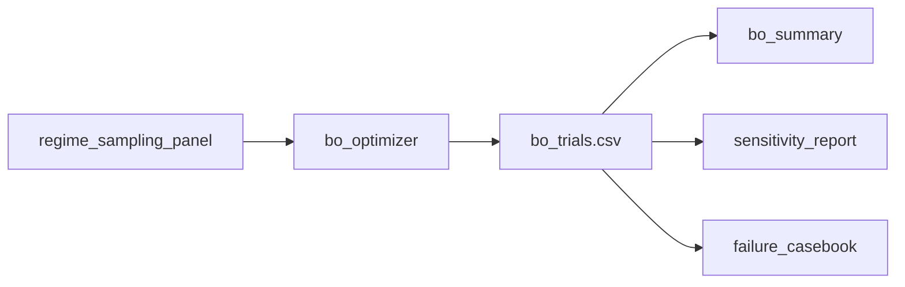

# 02 Coding Guide: BO Calibration

## Plan reference
`methods/plans/steps/02_bo_calibration.md`

## Target artifacts
- `data/{tunnel_id}/workflow/{run_id}/02_bo_calibration/bo_trials.csv`
- `data/{tunnel_id}/workflow/{run_id}/02_bo_calibration/bo_summary.md`
- `data/{tunnel_id}/workflow/{run_id}/02_bo_calibration/sensitivity_report.md`
- `data/{tunnel_id}/workflow/{run_id}/02_bo_calibration/failure_casebook.md`

## Files to create or modify
- `methods/ablation/scripts/run_bo_calibration.py` (new)
- `bo/run_offset_gt_bo.py` (reuse patterns only)
- `bo/logs/{tunnel_id}/` (write trial logs)

## Public functions
```python
def run_bo_for_ring(tunnel_id: str, ring_id: int, search_space: dict, budget: int) -> list[dict]
def evaluate_trial(tunnel_id: str, params: dict) -> dict
def write_trial_log(row: dict, out_csv: str) -> None
```

## Data flow


## Reuse points
- BO loop style in `bo/run_offset_gt_bo.py`
- Pipeline entrypoints:
  - `agents/irregular/1_preprocessing/1_preprocessing.py`
  - `agents/irregular/2_detection/2_detection.py`
  - `agents/irregular/3_segmentation/segmentation.py`
  - `agents/irregular/evaluation.py`

## Run commands
```bash
./venv/bin/python methods/ablation/scripts/run_bo_calibration.py --tunnel 4-1 --run pilot_001 --budget 50
./venv/bin/python methods/ablation/scripts/run_bo_calibration.py --tunnel 5-1 --run pilot_001 --budget 50
```

## Verification checklist
- Every trial row contains `trial_id`, `ring_id`, `regime`, `params`, `mIoU`, `OA`.
- Stage artifact paths resolve to existing files.
- Trial counts per regime match the requested BO budget allocation.
