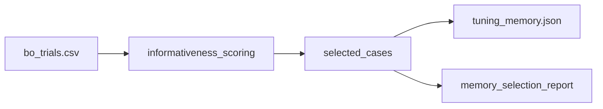

# 03 Coding Guide: Tuning Memory

## Plan reference
`methods/plans/steps/03_tuning_memory.md`

## Target artifacts
- `data/{tunnel_id}/workflow/{run_id}/03_tuning_memory/tuning_memory.json`
- `data/{tunnel_id}/workflow/{run_id}/03_tuning_memory/memory_selection_report.md`

## Files to create or modify
- `methods/ablation/scripts/build_tuning_memory.py` (new)

## Public functions
```python
def score_informativeness(trial_df: pd.DataFrame) -> pd.DataFrame
def select_memory_cases(scored_df: pd.DataFrame, per_regime_limit: int) -> list[dict]
def write_tuning_memory(cases: list[dict], out_json: str) -> None
```

## Data flow


## Reuse points
- BO schema from step-02 outputs
- Failure labels from `sensitivity_report.md` and `failure_casebook.md`

## Run commands
```bash
./venv/bin/python methods/ablation/scripts/build_tuning_memory.py --tunnel 4-1 --run pilot_001
./venv/bin/python methods/ablation/scripts/build_tuning_memory.py --tunnel 5-1 --run pilot_001
```

## Verification checklist
- Memory contains success, failure, correction, and regime-pattern entries.
- Duplicate cases are collapsed with documented selection rule.
- Each memory item follows: `condition -> params -> outcome -> explanation`.
