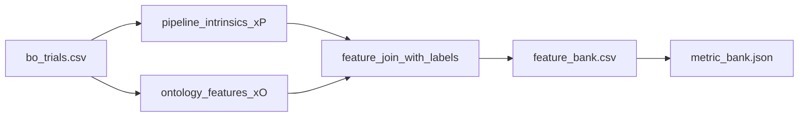

# 04 Coding Guide: Intrinsics and Ontology Features

## Plan reference
`methods/plans/steps/04_intrinsics_and_ontology.md`

## Target artifacts
- `data/{tunnel_id}/workflow/{run_id}/04_intrinsics_and_ontology/feature_bank.csv`
- `data/{tunnel_id}/workflow/{run_id}/04_intrinsics_and_ontology/metric_bank.json`
- `data/{tunnel_id}/workflow/{run_id}/04_intrinsics_and_ontology/intrinsics_ontology.md`

## Files to create or modify
- `methods/ablation/scripts/extract_feature_blocks.py` (new)
- `agents/irregular/3_segmentation/scripts/extract_intrinsics.py` (extend for missing features)

## Public functions
```python
def compute_pipeline_intrinsics(tunnel_dir: str, trial_row: dict) -> dict
def compute_ontology_features(tunnel_dir: str, trial_row: dict) -> dict
def build_feature_bank(trial_df: pd.DataFrame) -> pd.DataFrame
```

## Data flow


## Reuse points
- Existing intrinsic extraction in `agents/irregular/3_segmentation/scripts/extract_intrinsics.py`
- Segmentation outputs in `agents/irregular/3_segmentation/segmentation.py`

## Run commands
```bash
./venv/bin/python methods/ablation/scripts/extract_feature_blocks.py --tunnel 4-1 --run pilot_001
./venv/bin/python methods/ablation/scripts/extract_feature_blocks.py --tunnel 5-1 --run pilot_001
```

## Verification checklist
- `feature_bank.csv` has both `x_P_*` and `x_O_*` columns.
- Feature rows are keyed by `trial_id` and aligned to BO labels.
- `metric_bank.json` contains pass/warn/fail thresholds used by reflection rules.
