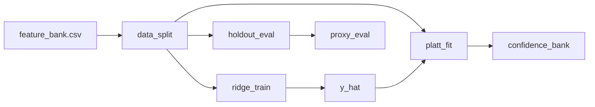

# 05 Coding Guide: Proxy and Calibration

## Plan reference
`methods/plans/steps/05_proxy_and_calibration.md`

## Target artifacts
- `data/{tunnel_id}/workflow/{run_id}/05_proxy_and_calibration/proxy.md`
- `data/{tunnel_id}/workflow/{run_id}/05_proxy_and_calibration/proxy_eval.json`
- `data/{tunnel_id}/workflow/{run_id}/05_proxy_and_calibration/calibration.json`
- `data/{tunnel_id}/workflow/{run_id}/05_proxy_and_calibration/confidence_bank.json`

## Files to create or modify
- `methods/ablation/scripts/train_proxy.py` (new)
- optional `methods/ablation/scripts/split_dataset.py` (new helper)

## Public functions
```python
def train_ridge_proxy(train_df: pd.DataFrame, feature_cols: list[str]) -> object
def calibrate_platt(calib_df: pd.DataFrame, y_hat_col: str, tau: float) -> dict
def evaluate_proxy(model: object, test_df: pd.DataFrame, tau: float, p_min: float) -> dict
```

## Data flow


## Reuse points
- Template schemas in `methods/plans/templates/proxy*.template`
- Metrics and acceptance semantics from `methods/plans/steps/00_methodology_chain.md`

## Run commands
```bash
./venv/bin/python methods/ablation/scripts/train_proxy.py --tunnel 4-1 --run pilot_001 --tau 0.60 --p-min 0.30
./venv/bin/python methods/ablation/scripts/train_proxy.py --tunnel 5-1 --run pilot_001 --tau 0.60 --p-min 0.30
```

## Verification checklist
- `proxy_eval.json` reports MAE/RMSE and calibration metrics.
- `calibration.json` contains `tau`, `platt_a`, `platt_c`, and calibration sample size.
- Acceptance rule in `proxy.md` is exactly: `y_hat >= tau AND p_good >= p_min`.
