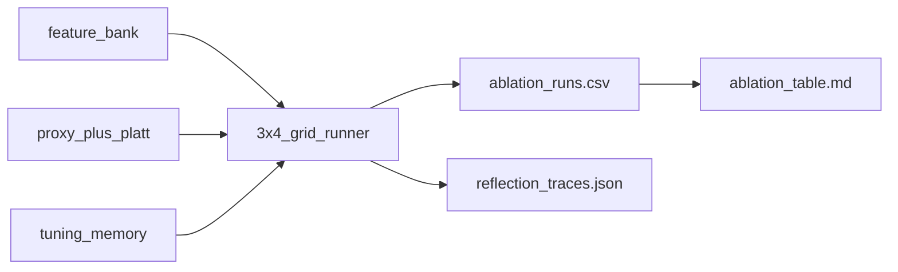

# 06 Coding Guide: Reflection Ablation

## Plan reference
`methods/plans/steps/06_reflection_ablation.md`

## Target artifacts
- `data/{tunnel_id}/workflow/{run_id}/06_reflection_ablation/ablation_runs.csv`
- `data/{tunnel_id}/workflow/{run_id}/06_reflection_ablation/reflection_traces.json`
- `data/{tunnel_id}/workflow/{run_id}/06_reflection_ablation/ablation_table.md`

## Files to create or modify
- `methods/ablation/scripts/run_reflection_ablation.py` (new)

## Public functions
```python
def run_ablation_cell(feature_mode: str, trigger_mode: str, budget: int, context: dict) -> dict
def apply_fixed_reflection_rules(metrics: dict) -> list[str]
def summarize_ablation(rows: list[dict]) -> pd.DataFrame
```

## Fixed rules (must remain unchanged)
- poor ring boundary quality -> rerun boundary detection
- poor oblique line quality -> adjust K-line detection
- invalid segment count -> adjust geometry segmentation
- high spacing irregularity -> rerun ring boundary detection

## Data flow


## Run commands
```bash
./venv/bin/python methods/ablation/scripts/run_reflection_ablation.py --tunnel 4-1 --run pilot_001 --budget 1
./venv/bin/python methods/ablation/scripts/run_reflection_ablation.py --tunnel 5-1 --run pilot_001 --budget 1
```

## Verification checklist
- Exactly 12 cells executed (`3 feature modes x 4 trigger modes`).
- Same reflection budget applied in every cell.
- No mention or call path to LLM/RL/adaptive routing.
