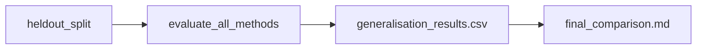

# 07 Coding Guide: Generalisation Test

## Plan reference
`methods/plans/steps/07_generalisation_test.md`

## Target artifacts
- `data/{tunnel_id}/workflow/{run_id}/07_generalisation_test/generalisation_results.csv`
- `data/{tunnel_id}/workflow/{run_id}/07_generalisation_test/final_comparison.md`

## Files to create or modify
- `methods/ablation/scripts/run_generalisation_test.py` (new)
- optionally reuse `methods/ablation/scripts/run_reflection_ablation.py`

## Public functions
```python
def build_heldout_split(all_rings: pd.DataFrame, strategy: str) -> dict
def evaluate_methods_on_split(split: dict, context: dict) -> pd.DataFrame
def render_final_comparison(df: pd.DataFrame, out_md: str) -> None
```

## Data flow


## Reuse points
- Method runners from steps 02, 05, and 06
- Evaluation entrypoint in `agents/irregular/evaluation.py`

## Run commands
```bash
./venv/bin/python methods/ablation/scripts/run_generalisation_test.py --train-tunnels 4-1 --test-tunnels 5-1 --run pilot_001
./venv/bin/python methods/ablation/scripts/run_generalisation_test.py --train-tunnels 5-1 --test-tunnels 4-1 --run pilot_001
```

## Verification checklist
- Held-out data is not used in BO/proxy/threshold/memory fitting.
- All compared methods run on the same held-out split.
- Report includes mIoU, OA, boundary/K-block/segment-count accuracy, proxy quality, reflection success/count, runtime.
