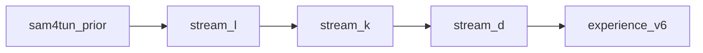

# BO proxy: three-axis experience (Proxy4Tun v1)

**Sandbox path:** `logs/proxy4tun/` — all new runs; do not write to `data/bo_calibration/` or `data/held-out/`.

**Corpus (read-only):** `data/bo_calibration/` (6 diversity rings). Held-out (`data/held-out/`, 50 rings) for final eval.

## Held-out eval: direction_select (required)

Every held-out / Stage-A candidate run uses **`bo/lib/candidate_eval.evaluate_candidate`** → **`evaluate_trial`** → **`direction_select`** (intrinsic plus/minus scoring, GT-free). Do not score candidates with single-branch seg only.

- **Runner:** `bo/run_held_out_score.py` (writes `direction_select_gate.json` per ring)
- **Panel gate:** `logs/<score_run>/direction_select_held_out_panel_gate.json`
- **Verify one ring:** `bo/verify_direction_e2e.py` on `data/held-out/`

## Design-time vs runtime GT

| Role | Streams L / K / D | Deploy |
|------|-------------------|--------|
| Warm-start anchor | SAM4Tun static only (`--warm-anchor sam4tun`) | SAM4Tun / line / hybrid — no GT positions |
| BO GP objective | `gt_miou` per trial (maximize EI) | — |
| Experience label | `label_gt_miou`, rank, regret vs `ceiling.json` | Not used |
| Proxy calibration | Spearman of intrinsic features vs `gt_miou` on calib panel | Predictors: intrinsic only |
| Locked v5 pool | Form P10–P90 templates only (`methods/paper/experience/`) | Clip form near non-GT anchor |

**No GT-anchor warm-start** (`--warm-anchor gt_derived`). Trials are honest perturbations around SAM4Tun, not oracle seeds from `gt_layout.json`.

## Three sequential streams (not one joint GP)



| Stream | `--run-root` | Vary | Freeze |
|--------|--------------|------|--------|
| **L** layout/form | `logs/proxy4tun/stream_l` | offsets, Hough/merge/snap, `r_surface_min`, `slot_inset_y` | `k_y`, K prior, preprocessing, seg count |
| **K** position | `logs/proxy4tun/stream_k` | `k_y_frac` only (`--stream k`) | L-best offsets + layout tail + `r_surface_min` from handoff |
| **D** order | `logs/proxy4tun/stream_d` | twin-branch (`plus`/`minus` scored) | L+K winners |

Runner: `bo/run_layout_bo.py experience --stream {full,layout,k}`.

**Deploy flag (yes/no):** `ring_is_regular` — intrinsic from preprocessing (`bo/lib/ring_regular.py`). 6-seg or 7-seg with nominal SAM tiling → `true`; 7-seg with AB rescale → `false`. Manifest: `logs/proxy4tun/stream_k/ring_regular_manifest.json`.

Trials/ring: L=64, K=48, D=32×2 branches (manifest sparse slots may override via `n_evals_for_ring_entry`).

## Proxy targets (calibration vs `gt_miou`)

- **L:** `form_arc_width_entropy`, `form_boundary_gap_norm`, `form_y_order_consistency`, `form_segment_coverage_pct`, `balance_norm`, `det_min_y_gap_px`
- **K:** `k_y_frac`, `layout_k_center_norm`, `k_anchor_dist_sam_frac`, `k_anchor_dist_line_frac`, `line_detection_confidence_K`, `rho_K`, `det_k_confidence_avg`, `det_min_y_gap_px`
- **D:** `template_match_score`, `direction_score_plus/minus`, `template_margin_minus_plus`, panel `direction_tier`

## Gates (before scaling)

1. `logs/proxy4tun/<stream>/single_instance_gate.json` — e.g. `4-6/r283` for Stream L
2. `bo/check_experience_honesty_gate.py --run-root <stream>`
3. Within-ring Spearman ≥ 0.15 on stream feature block (or document failure)
4. Stream L: best BO mIoU > SAM4Tun smoke from `logs/proxy4tun/sam4tun_prior/`

## Phase schedule

| Phase | Path | Status |
|-------|------|--------|
| 0 SAM4Tun prior | `logs/proxy4tun/sam4tun_prior/` | execute |
| 1 Stream L | `logs/proxy4tun/stream_l/` | execute |
| 2 Stream K | `logs/proxy4tun/stream_k/` | **done** (496 trials, 6/6 honesty) |
| 3 Stream D | `logs/proxy4tun/stream_d/` | **done** (368 trials, 6/6 honesty) |
| 4 v6 bank | `logs/proxy4tun/experience_v6/` | `bo/build_experience_bank.py`; promote to `methods/paper/experience/` only with user approval |

## Handoff L → K → D

- **L → K:** `logs/proxy4tun/stream_l/<tunnel>/r<N>/layout_best_for_stream_k.json`
- **K → D:** `logs/proxy4tun/stream_k/<tunnel>/r<N>/k_best_for_stream_d.json`

### Stream K results (calib panel)

| Ring | `ring_is_regular` | Stream L best | Stream K best | Lift vs L |
|------|-------------------|--------------:|--------------:|----------:|
| 1-1/r20 | yes | 0.463 | **0.691** | +0.228 |
| 1-4/r206 | yes | 0.261 | 0.319 | +0.059 |
| 1-5/r271 | yes | 0.337 | 0.343 | +0.006 |
| 4-1/r116 | no | 0.368 | **0.557** | +0.189 |
| 4-6/r283 | no | 0.345 | 0.387 | +0.042 |
| 5-5/r258 | no | 0.344 | 0.356 | +0.011 |

Mean panel best: Stream K **0.442** vs Stream L **0.353**. `k_y` explored (e.g. r283: 104 unique `k_y_frac`).

**Proxy calibration** (`logs/proxy4tun/analysis/stream_k_proxy_gate.json`): top \|ρ\| — `k_anchor_dist_sam_frac` (0.76), `k_anchor_dist_line_frac` (0.74), `row_nonempty_ratio` (0.32). Irregular stratum: `k_y_frac` ρ≈0.12; anchor-distance features dominate pooled rank.

**Commands:**

```bash
./venv/bin/python bo/run_layout_bo.py experience --stream k \
  --layout-handoff-root logs/proxy4tun/stream_l \
  --prior-root logs/proxy4tun/sam4tun_prior \
  --run-root logs/proxy4tun/stream_k
./venv/bin/python bo/analyze_stream_k_proxy_v1.py --run-root logs/proxy4tun/stream_k
```

### Stream D results (calib panel)

Frozen L+K from `k_best_for_stream_d.json`; trials vary plus/minus selection (`twin_baseline`, `force_plus`, `force_minus`).

| Ring | GT direction tier | Stream K best | Stream D best | Twin \|plus−minus\| mIoU |
|------|-------------------|--------------:|--------------:|------------------------:|
| 1-1/r20 | plus | 0.691 | 0.691 | 0.422 |
| 1-4/r206 | plus | 0.319 | 0.319 | (see trials) |
| 1-5/r271 | minus | 0.343 | 0.343 | — |
| 4-1/r116 | minus | 0.557 | 0.557 | — |
| 4-6/r283 | plus | 0.387 | 0.387 | — |
| 5-5/r258 | minus | 0.356 | 0.356 | — |

Mean best mIoU matches Stream K (**0.442**) — order axis confirms branch choice at frozen layout; large twin gaps on several rings (e.g. r20: plus 0.69 vs minus 0.27).

**Proxy calibration** (`logs/proxy4tun/analysis/stream_d_proxy_gate.json`): deploy-time candidates `direction_margin`, `template_margin_minus_plus`, `template_match_score_*`; design-time `oracle_branch_hit` ρ≈0.87 (not for runtime). **6/6** rings pass within-ring \|ρ\| ≥ 0.15 on D features.

**Commands:**

```bash
./venv/bin/python bo/run_layout_bo.py experience --stream d \
  --k-handoff-root logs/proxy4tun/stream_k \
  --run-root logs/proxy4tun/stream_d
./venv/bin/python bo/analyze_stream_d_proxy_v1.py --run-root logs/proxy4tun/stream_d
```

## Evidence (read-only)

- v4 SAM4Tun lift: `logs/bo_experience_v4_sam4tun_prior/vs_v3_summary.md`
- v7 joint layout BO: `stages/v7/logs/calib_detection_bo_v1/`
- Direction audit: `stages/v7/logs/proxy_reachability_v2/order_branch_audit.json`
- Panel counts: `methods/paper/panel_distribution_gate.json`

## Critical parameters

Paper Table `tab:workflow_critical_parameters` in `methods/paper/main.tex` — preprocessing frozen; BO searches detection layout + `r_surface_min` + segmentation inset only in Stream L.
