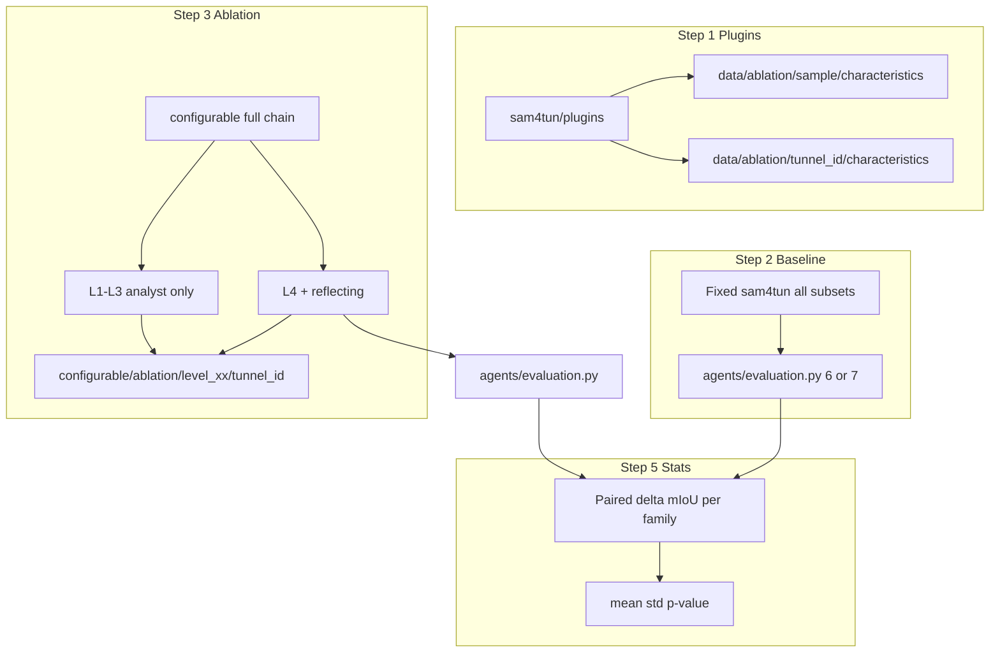

# Methodology chain: subset baselines → configurable ablation → paired statistics

Single overview for the **ablation study** comparing a **fixed engineer-designed `sam4tun` pipeline** (no per-tunnel adaptation) against the **`configurable` + `agents` pipeline** with **staged analyst context** (denoising analyst ablation) and **reflecting only at the final level**. **Bayesian optimisation (BO) is not used** in this setup.

Read this before running plugins, baselines, ablation runs, evaluation, and statistical comparison.

---

## Tunnel taxonomy (from `data/subsets` filenames)

All files under `data/subsets/` are **raw point clouds** (`.txt`). Classify by **filename prefix**:

| Prefix pattern | Layout class        | Semantic segments (GT / eval schema) |
|----------------|---------------------|--------------------------------------|
| `1_*`, `2_*`   | regularly_staggered | **6-class** (`agents/evaluation.py --schema 6`) |
| `3_*`          | continuous          | **6-class** |
| `4_*`, `5_*`   | complex_staggered   | **7-class** (`--schema 7`) |

Assign each file a **tunnel_id** (e.g. stem without `.txt`). Materialise working directories **`data/{tunnel_id}/`** as required by `sam4tun` and `configurable` (inputs, intermediates, `only_label.csv`, evaluation outputs).

---

## Ordered chain (high level)

1. **Characteristics (plugins)** — Run **`sam4tun/plugins`** on **`data/sample.txt`** (reference tunnel) and on **every** subset point cloud, and save JSON features under a stable tree (see below).
2. **Baseline mIoU (sam4tun)** — Run **one fixed** `sam4tun` script sequence and parameters **for all** subset tunnels (same engineer defaults; no BO, no per-tunnel retuning). Evaluate mIoU per tunnel with the correct **6 vs 7** schema. This quantifies **lack of adaptability** of the hand-tuned stack.
3. **Ablation pipeline (configurable + agents)** — Run the **full** end-to-end process: **unfolding → denoising → enhancing → detecting → segmenting**, driven by **`configurable/*.py`**. For each **ablation level**, persist parameters under **`configurable/ablation/…`** (see levels below). **No BO.** One **best** run per subset at **level 4** after **full reflecting** (levels 1–3: **no** reflecting).
4. **Evaluation** — `agents/evaluation.py` with **`--schema 6`** or **`--schema 7`** by family; write metrics under `data/{tunnel_id}/evaluation/` or `evaluation_7/` as implemented.
5. **Statistics** — **Paired** comparison per subset: **mIoU_agents − mIoU_sam4tun**. Report **mean and std** of the paired differences **per layout family** separately, plus a **p-value** (paired test) for whether agents/configurable beats the fixed sam4tun baseline on that family.

---

## Step 1 — Plugins: point-cloud characteristics

**Purpose:** Same structured descriptors for the **reference sample** and **each subset**, for analysts and for traceability.

**Scripts (under `sam4tun/plugins/`):** run the characterisers appropriate to each stage output as your project defines (e.g. unfolded / denoised / enhanced / detected), consistent with existing plugin contracts.

**Raw point cloud (pre-pipeline) characteristics:** from the repo root run  
`python methods/plans/steps/run_raw_characteristics_ablation.py`  
which reads `data/sample.txt` and `data/subsets/*.txt` and writes `raw_characteristics.json` under `data/ablation/{tunnel_id}/characteristics/` for `tunnel_id` = `sample` or each subset stem.

**Outputs (convention):**

- Reference sample: **`data/ablation/sample/characteristics/`** (JSON artefacts per plugin; use folder name **`characteristics`**, not `charateristics`).
- Each subset tunnel_id: **`data/ablation/{tunnel_id}/characteristics/`** (mirror structure under `sample`).

If a plugin currently assumes paths like `data/{tunnel_id}/`, either run it after copying/symlinking the subset into `data/{tunnel_id}/` or adapt invocations so tunnel_id resolves correctly; the methodology requires **one clear row in the journal** listing exact commands and paths.

---

## Step 2 — Baseline: fixed sam4tun on all subsets

- **Single** frozen configuration (scripts, checkpoints, default JSON params) for **every** subset.
- Run the full sam4tun pipeline that produces **`only_label.csv`** (or equivalent) per `data/{tunnel_id}/`.
- **Evaluate** with `agents/evaluation.py` using **6-class for `1_*`,`2_*`,`3_*`** and **7-class for `4_*`,`5_*`**.
- Log commands, git commit hash, and paths under **`data/logs/{tunnel_id}/`** (e.g. `baseline_sam4tun.json`, copied `performance.md`).

---

## Step 3 — Ablation: configurable end-to-end + denoising analyst levels

Run **`configurable/configurable_unfolding.py` → `configurable_denoising.py` → `configurable_enhancing.py` → `configurable_detecting.py` → `configurable_sam.py`** (order as in your operational checklist), reading/writing under `data/{tunnel_id}/` and **`configurable/ablation/`** for parameter snapshots.

**Denoising analyst (`agents/denoising/analyst.py`) context ablation — four levels:**

| Level | Name (concept) | What the analyst sees | Reflecting (`agents/reflecting`) |
|-------|----------------|------------------------|----------------------------------|
| **1** | Memory only    | Sample tunnel characteristics only | **Off** |
| **2** | Memory + state | Sample **+** new tunnel characteristics | **Off** |
| **3** | + Knowledge  | As level 2 **+** `agents/denoising/knowledge.md` | **Off** |
| **4** | Full           | Full analyst context as in production **+** **full reflecting** loop | **On** |

**Parameters:** save under e.g. **`configurable/ablation/level_{01..04}/{tunnel_id}/`** mirroring the usual `parameters_*.json` filenames (`parameters_denoising.json`, …), so each level is reproducible without overwriting `configurable/{tunnel_id}/` defaults.

**Stopping rule:** **No BO.** Per subset, **one** final mIoU after **level 4** and **full reflection**; levels 1–3 are for attributing gains, not for selecting BO trials.

Log all runs under **`data/logs/{tunnel_id}/`** (level id, timestamps, paths to saved params and evaluation).

---

## Step 4 — Evaluation artefacts

- Use **`agents/evaluation.py`** with **`--schema 6`** or **`--schema 7`** per family.
- Keep **baseline** and **ablation** `performance.md` / plots distinguishable in **`data/logs/{tunnel_id}/`** (copies or manifests pointing to `data/{tunnel_id}/evaluation/` vs `evaluation_7/`).

---

## Step 5 — Statistics (paired, per family)

For each **layout family** (`regularly_staggered`, `continuous`, `complex_staggered`):

1. For each subset *i* in that family, form **paired** values **(mIoU_sam4tun_i, mIoU_agents_i)** on the **same** tunnel_id and evaluation schema.
2. Difference **Δ_i = mIoU_agents_i − mIoU_sam4tun_i**.
3. Report **mean(Δ)**, **std(Δ)** (or SE), and **n**.
4. **P-value:** **paired** test on the Δ_i (e.g. **paired t-test** if normality is plausible; else **Wilcoxon signed-rank** on paired observations). State the test and significance level (e.g. α = 0.05).

Do **not** pool all subsets into one global p-value without a clear hierarchical plan; **primary reporting is per family** as above.

---

## Data flow (mermaid)

---

## Dependencies and scope

- **GT** is used **only** for **mIoU** evaluation and statistics (design-time / study metric), not for runtime pipeline decisions in this chain.
- Steps **01–05** in `methods/plans/steps/` may still inform *documentation* of assumptions; **this chain replaces BO-centric steps 06–09** for the ablation study. Do not require BO, proxy, or Platt calibration for this workflow.
- **Reproducibility:** every run leaves a trace under **`data/logs/{tunnel_id}/`** (commands, commit, parameter paths, evaluation paths).

---

## Files and entrypoints (reference)

| Piece | Location |
|-------|----------|
| Subset point clouds | `data/subsets/*.txt` |
| Reference sample | `data/sample.txt` |
| Characteristics output | `data/ablation/sample/characteristics/`, `data/ablation/{tunnel_id}/characteristics/` |
| Configurable stages | `configurable/configurable_unfolding.py`, `configurable_denoising.py`, `configurable_enhancing.py`, `configurable_detecting.py`, `configurable_sam.py` |
| Denoising analyst | `agents/denoising/analyst.py` |
| Denoising knowledge (level 3+) | `agents/denoising/knowledge.md` |
| Reflecting (level 4 only) | `agents/reflecting/` |
| Ablation parameter snapshots | `configurable/ablation/level_01` … `level_04` / `{tunnel_id}/` |
| mIoU evaluation | `agents/evaluation.py` (`--schema 6` / `7`) |
| Run logs | `data/logs/{tunnel_id}/` |

---

## Checklist (operator)

- [ ] Map each `data/subsets/*.txt` to **tunnel_id** and **family** (1–2 / 3 / 4–5).
- [ ] Materialise `data/{tunnel_id}/` inputs as required.
- [ ] Run plugins → `data/ablation/sample/characteristics/` and per-tunnel `data/ablation/{tunnel_id}/characteristics/`.
- [ ] Run **fixed** sam4tun baseline → evaluate → copy/summarise to `data/logs/{tunnel_id}/`.
- [ ] For levels 1→4, run **configurable** + analyst rules + reflecting only at 4; save params under `configurable/ablation/level_xx/{tunnel_id}/`.
- [ ] Evaluate ablation mIoU (correct schema per family).
- [ ] Compute **paired** Δ per subset; **per family**: mean, std, p-value; document test choice.
