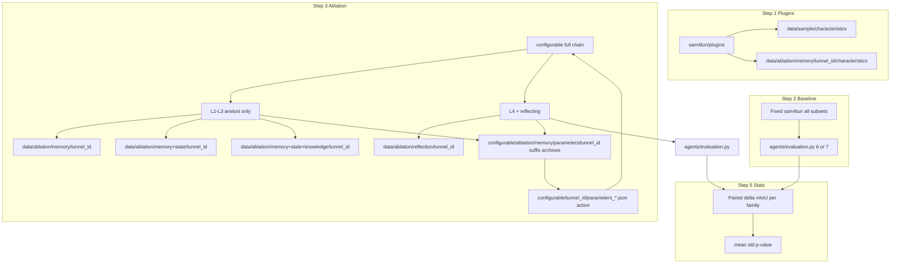

# Methodology chain: subset baselines → configurable ablation → paired statistics

Single overview for the **ablation study** comparing a **fixed engineer-designed `sam4tun` pipeline** (no per-tunnel adaptation) against the **`configurable` + `agents` pipeline** with **staged analyst context** (denoising analyst ablation) and **reflecting only at the final level**. **Bayesian optimisation (BO) is not used** in this setup.

Read this before running plugins, baselines, ablation runs, evaluation, and statistical comparison.

---

## Tunnel taxonomy (from `data/subsets` filenames)

All files under `data/subsets/` are **raw point clouds** (`.txt`). Classify by **filename prefix**:

| Prefix pattern | Layout class        | Semantic segments (GT / eval schema) |
|----------------|---------------------|--------------------------------------|
| `1_*`, `2_*`   | regularly_staggered | **6-class** (`agents/evaluation.py --schema 6`) |
| `3_*`          | continuous          | **6-class** |
| `4_*`, `5_*`   | complex_staggered   | **7-class** (`--schema 7`) |

Assign each file a **tunnel_id** (e.g. stem without `.txt`). Materialise working directories **`data/{tunnel_id}/`** as required by `sam4tun` and `configurable` (inputs, intermediates, `only_label.csv`, evaluation outputs).

---

## Ordered chain (high level)

1. **Characteristics (plugins)** — Run **`sam4tun/plugins`** on **`data/sample.txt`** (reference tunnel) and on **every** subset point cloud, and save JSON features under a stable tree (see below).
2. **Baseline mIoU (sam4tun)** — Run **one fixed** `sam4tun` script sequence and parameters **for all** subset tunnels (same engineer defaults; no BO, no per-tunnel retuning). Evaluate mIoU per tunnel with the correct **6 vs 7** schema. This quantifies **lack of adaptability** of the hand-tuned stack.
3. **Ablation pipeline (configurable + agents)** — For each subset tunnel, run the **full** end-to-end process **four times** (same raw point cloud each time), differing by **denoising analyst context**. Persist **full artefact trees** under the **semantic roots** **`memory`**, **`memory+state`**, **`memory+state+knowledge`**, **`reflection`** (see Step 3 — each mirrors **`data/sample/`**). Archive parameter JSON under **`configurable/ablation/memory/parameters/{tunnel_id}/`** with suffixes **`-m`**, **`-m+s`**, **`-m+s+k`**, **`-m+s+k+r`** that **match those output roots one-to-one**. Keep **`configurable/{tunnel_id}/parameters_*.json`** as the **active** files **`configurable/*.py`** read. **No BO.** **Reflecting only in the `reflection` run.**
4. **Evaluation** — `agents/evaluation.py` with **`--schema 6`** or **`--schema 7`** by family (or **`--schema auto`**); metrics always under `data/{tunnel_id}/evaluation/` (`performance.md`; **`--schema both`** adds `performance_6.md` / `performance_7.md` and suffixed plots).
5. **Statistics** — **Paired** comparison per subset: **mIoU_agents − mIoU_sam4tun**. Report **mean and std** of the paired differences **per layout family** separately, plus a **p-value** (paired test) for whether agents/configurable beats the fixed sam4tun baseline on that family.

---

## Step 1 — Plugins: point-cloud characteristics

**Purpose:** Same structured descriptors for the **reference sample** and **each subset**, for analysts and for traceability.

**Scripts (under `sam4tun/plugins/`):** run the characterisers appropriate to each stage output as your project defines (e.g. unfolded / denoised / enhanced / detected), consistent with existing plugin contracts.

**Raw point cloud (pre-pipeline) characteristics:** from the repo root run  
`python methods/plans/steps/run_raw_characteristics_ablation.py`  
which reads `data/sample.txt` and `data/subsets/*.txt` and writes `raw_characteristics.json` under **`data/sample/characteristics/`** for the reference sample and **`data/ablation/memory/{tunnel_id}/characteristics/`** for each subset stem (layout knob: `ABLATION_TUNNEL_SUBROOT` in `sam4tun/plugins/paths.py`).

**Outputs (convention):**

- Reference sample (universal baseline): **`data/sample/characteristics/`** (JSON artefacts per plugin; folder name **`characteristics`**, not `charateristics`).
- **`data/ablation/memory/{tunnel_id}/characteristics/`** — **raw / pre-pipeline** characteristics (e.g. `raw_characteristics.json`). **Level 1** (`-m`) **full pipeline** outputs use the **same tunnel root** **`data/ablation/memory/{tunnel_id}/`**: CSVs and other artefacts sit next to the existing `characteristics/` subfolder (so raw JSON and the memory-only run share one tree). **Levels 2–4** use **separate roots** (Step 3) with **no** duplicate raw batch there unless you copy for traceability.

If a plugin currently assumes paths like `data/{tunnel_id}/`, either run it after copying/symlinking the subset into `data/{tunnel_id}/` or adapt invocations so tunnel_id resolves correctly; the methodology requires **one clear row in the journal** listing exact commands and paths.

**Staged characterisers (unfolded → denoised → enhanced → detected)** for the **reference** tunnel only: after `data/sample/` contains `unwrapped.csv`, `denoised.csv`, `enhanced.csv`, and `detected.csv`, run from repo root with `PYTHONPATH=.` (so `sam4tun.plugins` imports resolve):

```bash
export PYTHONPATH=.
python sam4tun/plugins/1-unfolded_characteriser.py sample
python sam4tun/plugins/2-denoised_characteriser.py sample
python sam4tun/plugins/3-enhanced_characteriser.py sample
python sam4tun/plugins/4-detected_characteriser.py sample
```

All four write under **`data/sample/characteristics/`** when `tunnel_id` is **`sample`**. For a **subset** tunnel with materialised `data/{tunnel_id}/` CSVs, pass that `tunnel_id` instead; JSON then lands under **`data/ablation/memory/{tunnel_id}/characteristics/`** (unless `ABLATION_TUNNEL_SUBROOT` is changed).

---

## Step 2 — Baseline: fixed sam4tun on all subsets

- **Single** frozen configuration (scripts, checkpoints, default JSON params) for **every** subset.
- Run the full sam4tun pipeline that produces **`only_label.csv`** (or equivalent) per `data/{tunnel_id}/`.
- **Evaluate** with `agents/evaluation.py` using **6-class for `1_*`,`2_*`,`3_*`** and **7-class for `4_*`,`5_*`**.
- Log commands, git commit hash, and paths under **`data/logs/{tunnel_id}/`** (e.g. `baseline_sam4tun.json`, copied `performance.md`).

---

## Step 3 — Ablation: configurable end-to-end + denoising analyst levels

**Goal:** For each subset **`tunnel_id`**, same **raw** input as in **`data/subsets/{tunnel_id}.txt`** (materialised under **`data/{tunnel_id}/`** for the active run), produce **four** complete output trees comparable to **`data/sample/`**.

### 3a — Full pipeline outputs per condition (mirror `data/sample/`)

**Parameter archive suffix ↔ output root (must stay aligned):**

| Condition | Archived `parameters_denoising.json` suffix | Output root (`data/ablation/<root>/{tunnel_id}/`) |
|-----------|---------------------------------------------|---------------------------------------------------|
| Memory only | **`-m`** | **`memory`** |
| Memory + state | **`-m+s`** | **`memory+state`** |
| Memory + state + knowledge | **`-m+s+k`** | **`memory+state+knowledge`** |
| + reflecting (full) | **`-m+s+k+r`** | **`reflection`** |

Each run should populate the usual artefacts (`unwrapped.csv`, `denoised.csv`, `enhanced.csv`, `detected.csv`, `final.csv`, `only_label.csv`, `evaluation/`, per-stage `characteristics/` as applicable, etc.). **`data/sample/`** remains the **single universal reference**; it is **not** copied under these roots.

**Shell note:** folder names contain **`+`**; quote paths in shell scripts if needed (e.g. `"data/ablation/memory+state/1-4"`).

**Implementation note:** `configurable/*.py` today default to **`data/{tunnel_id}/`**. Point each run at the matching **`data/ablation/<root>/{tunnel_id}/`** once a path flag exists, or run into **`data/{tunnel_id}/`** and **copy/rsync** the finished tree to the correct **`data/ablation/.../{tunnel_id}/`** after each condition. Constants: **`sam4tun.plugins.paths.ABLATION_SUFFIX_TO_OUTPUT_ROOT`** and **`ablation_run_data_dir(tunnel_id, root)`**.

### 3b — Denoising analyst context (four levels)

| Level | Name (concept) | What the analyst sees | Reflecting (`agents/reflecting`) |
|-------|----------------|------------------------|----------------------------------|
| **1** | Memory only (`m`) | Sample tunnel characteristics only | **Off** |
| **2** | Memory + state (`m+s`) | Sample **+** new tunnel characteristics | **Off** |
| **3** | + Knowledge (`m+s+k`) | As level 2 **+** `agents/denoising/knowledge.md` | **Off** |
| **4** | Full (`m+s+k+r`) | Full analyst context **+** **full reflecting** | **On** |

### 3c — Parameter snapshots (archive) vs active file for `configurable`

Archive **denoising** (and, by the same pattern, other stages if needed) JSON **per tunnel** under:

**`configurable/ablation/memory/parameters/{tunnel_id}/`**

Example for tunnel **`1-4`** — filenames **match** the **data** roots in §3a:

| Archived filename | Analyst meaning | **Must** correspond to output under |
|-------------------|-----------------|-------------------------------------|
| `parameters_denoising.json-m` | Memory only | **`data/ablation/memory/1-4/`** |
| `parameters_denoising.json-m+s` | Memory + state | **`data/ablation/memory+state/1-4/`** |
| `parameters_denoising.json-m+s+k` | + knowledge | **`data/ablation/memory+state+knowledge/1-4/`** |
| `parameters_denoising.json-m+s+k+r` | + reflecting | **`data/ablation/reflection/1-4/`** |

**Active path for execution:** **`configurable/{tunnel_id}/parameters_denoising.json`** — what **`configurable/configurable_denoising.py`** expects. **Before each condition’s pipeline run:** install the matching archived file as that canonical name, then **save/refresh** the archive after the run so the suffix file matches the tree under **`data/ablation/<root>/{tunnel_id}/`**.

Same suffix convention may be applied to **`parameters_unfolding.json`**, **`parameters_enhancing.json`**, **`parameters_detecting.json`**, **`parameters_sam.json`** when those stages participate in the ablation.

**Stopping rule:** **No BO.** Per subset, **one** final mIoU after the **`reflection`** condition; earlier conditions attribute gains. Log under **`data/logs/{tunnel_id}/`** (include **condition** name, paths to archive + active params, and **`data/ablation/<root>/...`** output paths).

---

## Step 4 — Evaluation artefacts

- Use **`agents/evaluation.py`** with **`--schema 6`** or **`--schema 7`** per family (or **`auto` / `both`**).
- For ablation runs, evaluate from each condition’s **`only_label.csv`** under **`data/ablation/memory/{tunnel_id}/`**, **`data/ablation/memory+state/{tunnel_id}/`**, **`data/ablation/memory+state+knowledge/{tunnel_id}/`**, **`data/ablation/reflection/{tunnel_id}/`** (or pass the equivalent path).
- Keep **baseline**, **per-condition ablation**, and **main** `data/{tunnel_id}/` results distinguishable in **`data/logs/{tunnel_id}/`** (copies or manifests; include **condition** / suffix in filenames where helpful).

---

## Step 5 — Statistics (paired, per family)

For each **layout family** (`regularly_staggered`, `continuous`, `complex_staggered`):

1. For each subset *i* in that family, form **paired** values **(mIoU_sam4tun_i, mIoU_agents_i)** on the **same** tunnel_id and evaluation schema.
2. Difference **Δ_i = mIoU_agents_i − mIoU_sam4tun_i**.
3. Report **mean(Δ)**, **std(Δ)** (or SE), and **n**.
4. **P-value:** **paired** test on the Δ_i (e.g. **paired t-test** if normality is plausible; else **Wilcoxon signed-rank** on paired observations). State the test and significance level (e.g. α = 0.05).

Do **not** pool all subsets into one global p-value without a clear hierarchical plan; **primary reporting is per family** as above.

---

## Data flow (mermaid)



---

## Dependencies and scope

- **GT** is used **only** for **mIoU** evaluation and statistics (design-time / study metric), not for runtime pipeline decisions in this chain.
- Steps **01–05** in `methods/plans/steps/` may still inform *documentation* of assumptions; **this chain replaces BO-centric steps 06–09** for the ablation study. Do not require BO, proxy, or Platt calibration for this workflow.
- **Reproducibility:** every run leaves a trace under **`data/logs/{tunnel_id}/`** (commands, commit, parameter paths, evaluation paths).

---

## Files and entrypoints (reference)

| Piece | Location |
|-------|----------|
| Subset point clouds | `data/subsets/*.txt` |
| Reference sample | `data/sample.txt` |
| Raw / pre-pipeline characteristics | `data/sample/characteristics/` · `data/ablation/memory/{tunnel_id}/characteristics/` only |
| Full pipeline outputs (ablation, 4×) | `data/ablation/memory` · `memory+state` · `memory+state+knowledge` · `reflection` / `{tunnel_id}/` (mirror `data/sample/`) |
| Suffix ↔ folder map | `sam4tun.plugins.paths.ABLATION_SUFFIX_TO_OUTPUT_ROOT` |
| Path layout knob (raw + `-m` root name) | `ABLATION_TUNNEL_SUBROOT` in `sam4tun/plugins/paths.py` — keep **`memory`** |
| Parameter archive (ablation) | `configurable/ablation/memory/parameters/{tunnel_id}/` · `parameters_denoising.json-m`, `-m+s`, `-m+s+k`, `-m+s+k+r` |
| Active params for configurable scripts | `configurable/{tunnel_id}/parameters_*.json` (e.g. `parameters_denoising.json`) |
| Configurable stages | `configurable/configurable_unfolding.py`, `configurable_denoising.py`, `configurable_enhancing.py`, `configurable_detecting.py`, `configurable_sam.py` |
| Denoising analyst | `agents/denoising/analyst.py` |
| Denoising knowledge (level 3+) | `agents/denoising/knowledge.md` |
| Reflecting (level 4 only) | `agents/reflecting/` |
| mIoU evaluation | `agents/evaluation.py` (`--schema auto` / `6` / `7` / `both`) |
| Raw characteristics batch | `methods/plans/steps/run_raw_characteristics_ablation.py` |
| Run logs | `data/logs/{tunnel_id}/` |

---

## Checklist (operator)

- [ ] Map each `data/subsets/*.txt` to **tunnel_id** and **family** (1–2 / 3 / 4–5).
- [ ] Materialise `data/{tunnel_id}/` inputs as required.
- [ ] Run plugins → reference under `data/sample/characteristics/`, each subset under `data/ablation/memory/{tunnel_id}/characteristics/`.
- [ ] Run **fixed** sam4tun baseline → evaluate → copy/summarise to `data/logs/{tunnel_id}/`.
- [ ] For each condition: run **configurable** + analyst rules (**reflecting only** for **`reflection`** / `-m+s+k+r`); write full outputs under **`data/ablation/memory|memory+state|memory+state+knowledge|reflection/{tunnel_id}/`** matching the archived **`parameters_*.{suffix}`**; keep **`configurable/{tunnel_id}/parameters_*.json`** as the active copy per run.
- [ ] Evaluate ablation mIoU (correct schema per family).
- [ ] Compute **paired** Δ per subset; **per family**: mean, std, p-value; document test choice.
